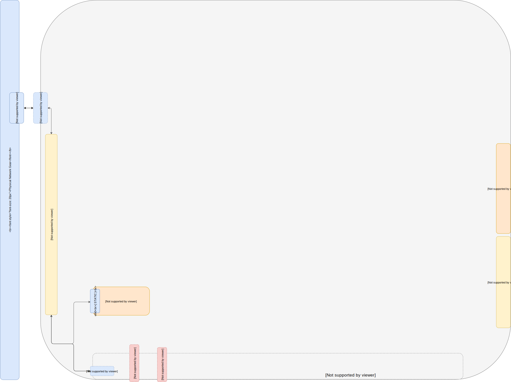

# Part 2 -- LXD On Open vSwitch Network
##### Install and Configure LXD on a default Open vSwitch Network Bridge
NOTE: This will expose container networking on your LAN by default    

-------
Prerequisites:
- [Part 0 Host System Prep]
- [Part 1 Single Port Host OVS Network]



-------
#### 01. Install LXD Packages
````sh
apt install -y lxd squashfuse zfsutils-linux btrfs-tools && sudo modprobe zfs
````

#### 02. Initialize LXD
````sh
sudo lxd init
````
###### Example Interactive Init
````sh
root@bionic:~# lxd init
Would you like to use LXD clustering? (yes/no) [default=no]: no
Do you want to configure a new storage pool? (yes/no) [default=yes]: yes
Name of the new storage pool [default=default]: default
Name of the storage backend to use (btrfs, dir, lvm) [default=btrfs]: dir
Would you like to connect to a MAAS server? (yes/no) [default=no]: no
Would you like to create a new local network bridge? (yes/no) [default=yes]: no
Would you like to configure LXD to use an existing bridge or host interface?(yes/no) [default=no]: yes
Name of the existing bridge or host interface: wan
Would you like LXD to be available over the network? (yes/no) [default=no]: yes
Address to bind LXD to (not including port) [default=all]: all
Port to bind LXD to [default=8443]: 8443
Trust password for new clients:
Again:
Would you like stale cached images to be updated automatically? (yes/no) [default=yes] yes
Would you like a YAML "lxd init" preseed to be printed? (yes/no) [default=no]: yes
````
#### 03. Add your user(s) to the 'lxd' group with the following syntax for each user
Use your non-root host user name (EG: 'ubuntu')
````sh
sudo usermod -aG lxd ubuntu
````
#### 04. Backup the original lxc profile
````sh
lxc profile copy default original
````
#### 05. Add 'lxc' command alias 'ubuntu'/'(your username)' to auto login to containers as user 'ubuntu'
````sh
sed -i 's/aliases: {}/aliases:\n  ubuntu: exec @ARGS@ -- sudo --login --user ubuntu/g' ~/.config/lxc/config.yml
````
-------
#### PROTIP: Add User-Data && Launch Containers && check Configurations
##### Exhibit(A) Add cloud-init user-data to your default profile
###### 01. Download the profile template
````sh
wget -O- https://git.io/fjmSw | bash
````
###### 02. Edit default profile template
````sh
vim /tmp/lxd-profile-default.yaml
````
###### 03. Apply configuration to default profile
````sh
lxc profile edit default < /tmp/lxd-profile-default.yaml
````
##### Exhibit(B) Launch && Acquire Shell / Exit Shell && Delete Containers
````sh
lxc launch ubuntu:bionic c01
lxc launch images:centos/7 test-centos
lxc launch images:fedora/28 test-fedora

lxc list

lxc exec c01 bash
exit

lxc delete c01 --force
lxc delete test-centos --force
lxc delete test-fedora --force
````
###### Exhibit(C) Check LXD Configurations
````sh
lxc network list
lxc network show wan

lxc profile list
lxc profile show default

lxc config show c01
````
-------
## Next sections
- [Part 3 LXD Gateway & Firwall for Open vSwitch Network Isolation]
- [Part 4 KVM On Open vSwitch]
- [Part 5 MAAS Region And Rack Server on OVS Sandbox]
- [Part 6 MAAS Connect POD on KVM Provider]
- [Part 7 Juju MAAS Cloud]
- [Part 8 OpenStack Prep]

<!-- Markdown link & img dfn's -->
[Part 0 Host System Prep]: ../0_Host_System_Prep
[Part 1 Single Port Host OVS Network]: ../1_Single_Port_Host-Open_vSwitch_Network_Configuration
[Part 2 LXD On Open vSwitch Network]: ../2_LXD-On-OVS
[Part 3 LXD Gateway & Firwall for Open vSwitch Network Isolation]: ../3_LXD_Network_Gateway
[Part 4 KVM On Open vSwitch]: ../4_KVM_On_Open_vSwitch
[Part 5 MAAS Region And Rack Server on OVS Sandbox]: ../5_MAAS-Rack_And_Region_Ctl-On-Open_vSwitch
[Part 6 MAAS Connect POD on KVM Provider]: ../6_MAAS-Connect_POD_KVM-Provider
[Part 7 Juju MAAS Cloud]: ../7_Juju_MAAS_Cloud
[Part 8 OpenStack Prep]: ../8_OpenStack_Deploy
