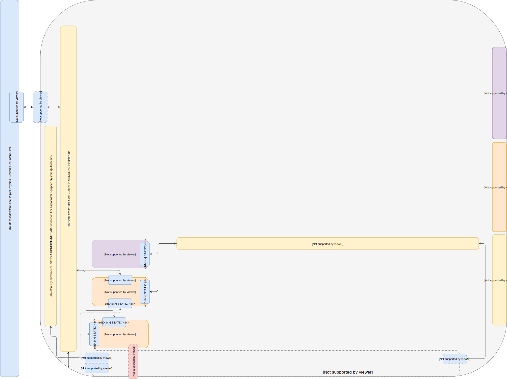

# Part 4 -- KVM On Open vSwitch
###### Install and Configure Libvirt / KVM / QEMU on a Default Open vSwitch Network

-------
Prerequisites:
- [Part 0 Host System Prep]
- [Part 1 Single Port Host OVS Network]
- [Part 2 LXD On Open vSwitch Network]
- [Part 3 LXD Gateway & Firwall for Open vSwitch Network Isolation]



-------
#### 01. Install Packages
````sh
apt install -y qemu qemu-kvm qemu-utils libvirt-bin libvirt0
````
#### 02. Backup & Destroy default NAT Network
````sh
mkdir ~/bak 2>/dev/null ; virsh net-dumpxml default | tee ~/bak/virsh-net-default-bak.xml
virsh net-destroy default && virsh net-undefine default
````
#### 03. Write xml config for 'default' network on 'lan' bridge
````sh
cat <<EOF >/tmp/virsh-net-default-on-lan.json
<network>
  <name>default</name>
  <forward mode='bridge'/>
  <bridge name='lan' />
  <virtualport type='openvswitch'/>
</network>
EOF
````
#### 04. Write xml config 'lan' network on 'lan' bridge
````sh
cat <<EOF >/tmp/virsh-net-lan-on-lan.json
<network>
  <name>lan</name>
  <forward mode='bridge'/>
  <bridge name='lan' />
  <virtualport type='openvswitch'/>
</network>
EOF

````
#### 05. Write xml config 'wan' network on 'wan' bridge
````sh
cat <<EOF >/tmp/virsh-net-wan-on-wan.json
<network>
  <name>wan</name>
  <forward mode='bridge'/>
  <bridge name='wan' />
  <virtualport type='openvswitch'/>
</network>
EOF
````
#### 06. Create networks from config files
````sh
for json in virsh-net-default-on-lan.json virsh-net-lan-on-lan.json virsh-net-wan-on-wan.json; do virsh net-define /tmp/${json}; done
for virshet in wan default lan; do virsh net-start ${virshet}; virsh net-autostart ${virshet}; done
````
#### 07. Verify virsh network:
````sh
sudo virsh net-list --all
````
````sh
 Name                 State      Autostart     Persistent
----------------------------------------------------------
 default              active     yes           yes
 lan                  active     yes           yes
 wan                  active     yes           yes
````

-------
## Next sections
- [Part 5 MAAS Region And Rack Server on OVS Sandbox]
- [Part 6 MAAS Connect POD on KVM Provider]
- [Part 7 Juju MAAS Cloud]
- [Part 8 OpenStack Prep]

<!-- Markdown link & img dfn's -->
[Part 0 Host System Prep]: ../0_Host_System_Prep
[Part 1 Single Port Host OVS Network]: ../1_Single_Port_Host-Open_vSwitch_Network_Configuration
[Part 2 LXD On Open vSwitch Network]: ../2_LXD-On-OVS
[Part 3 LXD Gateway & Firwall for Open vSwitch Network Isolation]: ../3_LXD_Network_Gateway
[Part 4 KVM On Open vSwitch]: ../4_KVM_On_Open_vSwitch
[Part 5 MAAS Region And Rack Server on OVS Sandbox]: ../5_MAAS-Rack_And_Region_Ctl-On-Open_vSwitch
[Part 6 MAAS Connect POD on KVM Provider]: ../6_MAAS-Connect_POD_KVM-Provider
[Part 7 Juju MAAS Cloud]: ../7_Juju_MAAS_Cloud
[Part 8 OpenStack Prep]: ../8_OpenStack_Deploy
