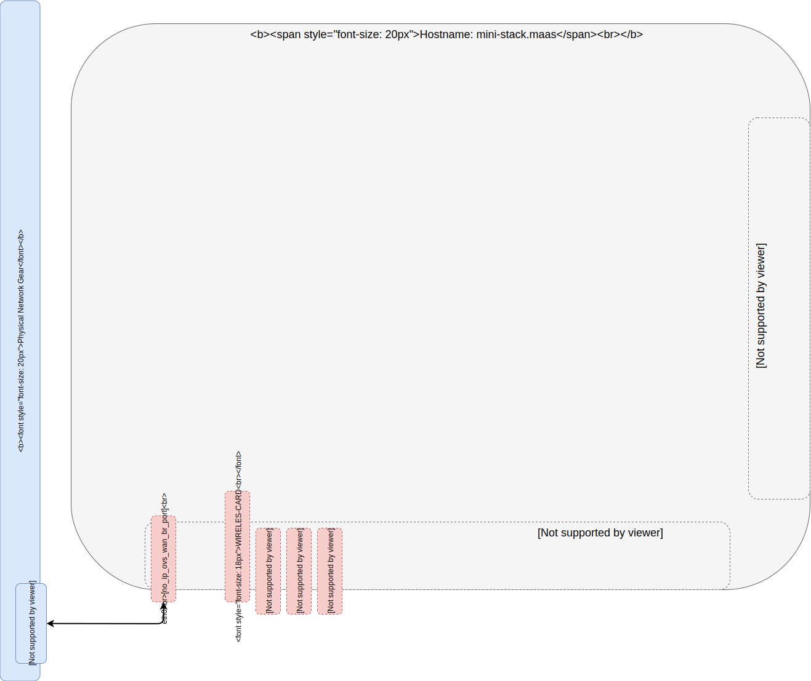
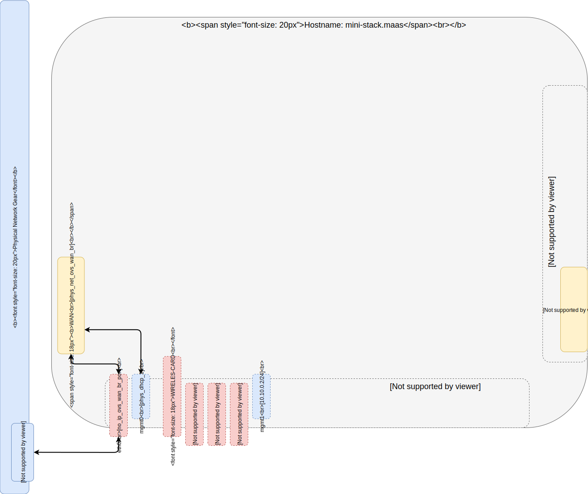
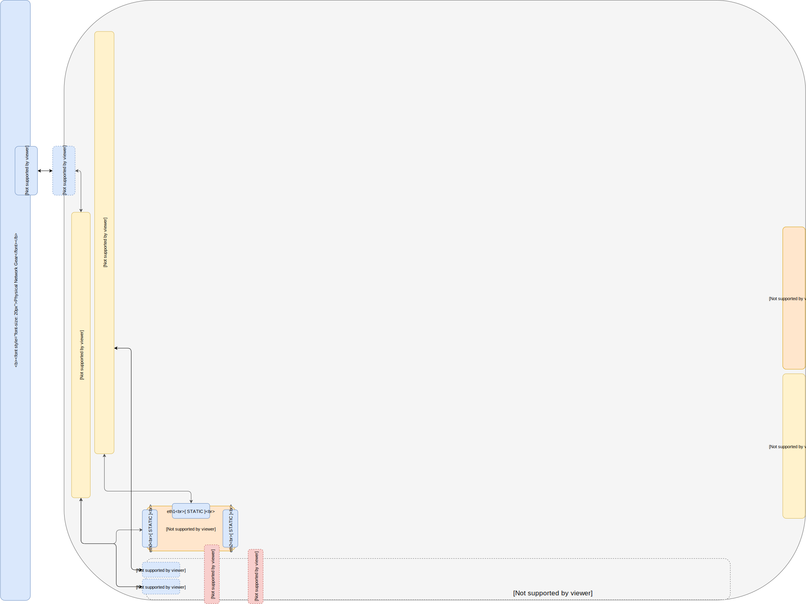
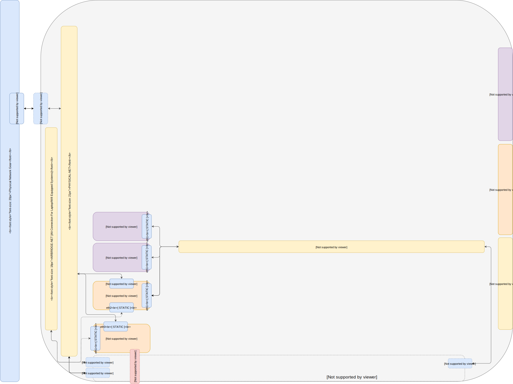
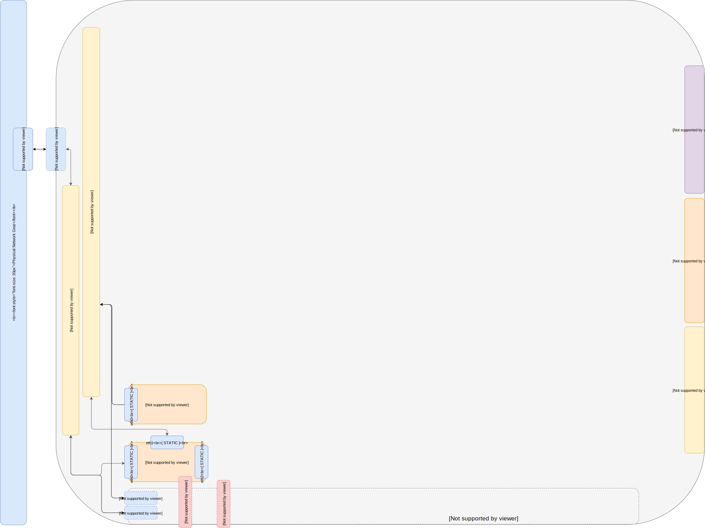
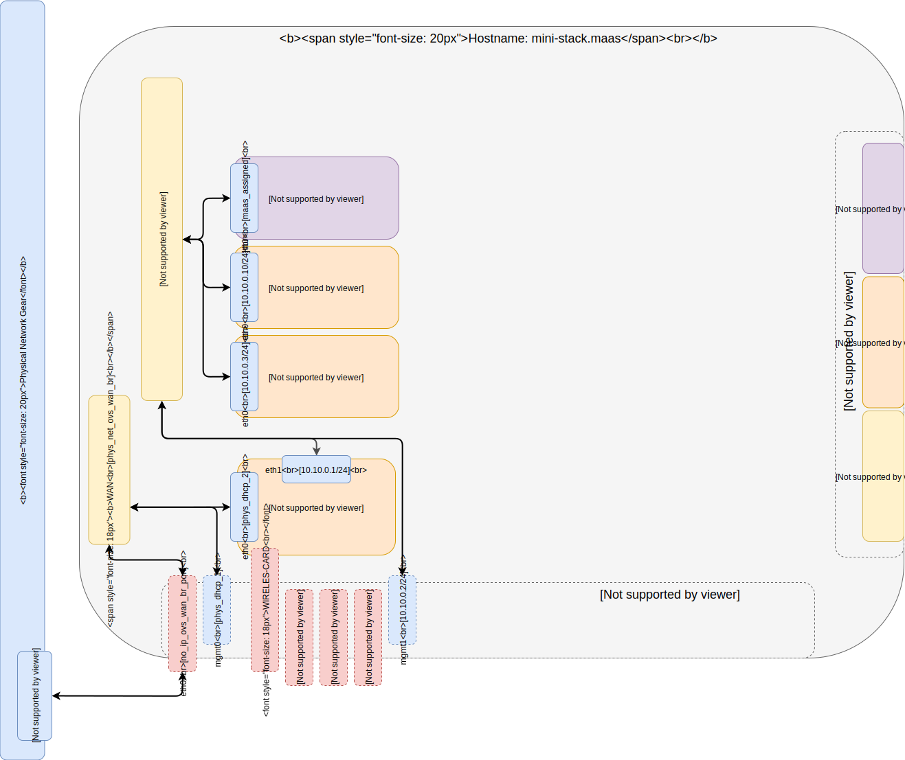
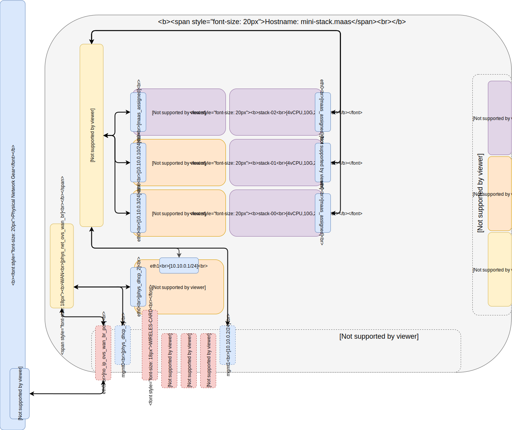

# Index:

## [Part 0 -- Host System Prep](../1_Single_Port_Host-Open_vSwitch_Network_Configuration)

 
## [Part 1 -- Single Port Host Open vSwitch Network Configuration](../1_Single_Port_Host-Open_vSwitch_Network_Configuration)

 
## [Part 2 -- LXD On Open vSwitch Network](../2_LXD-On-OVS)

 
## [Part 3 -- LXD Gateway & Firwall for Open vSwitch Network Isolation](../3_LXD_Network_Gateway)

 
## [Part 4 -- KVM On Open vSwitch](../4_KVM_On_Open_vSwitch)

 
## [Part 5 -- MAAS Region And Rack Server on OVS Sandbox](../5_MAAS-Rack_And_Region_Ctl-On-Open_vSwitch)

 
## [Part 6 -- MAAS Connect POD on KVM Provider](../6_MAAS-Connect_POD_KVM-Provider)

 
## [Part 7 -- Juju MAAS Cloud](../7_Juju_MAAS_Cloud)

 
## [Part 8 -- OpenStack Prep](../8_OpenStack_Deploy)

 
